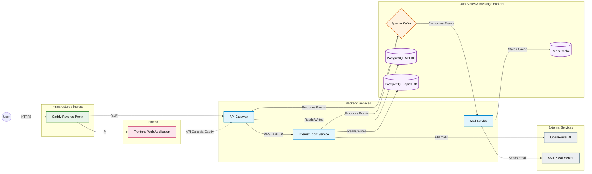

# SignalFlow

SignalFlow is a microservices-based application.

## Architecture

This section provides a high-level overview of the SignalFlow microservices architecture.

### Components Breakdown

1. **Ingress (Caddy)**: Serves as the reverse proxy for handling incoming HTTP/HTTPS requests and routing them to either the frontend or the API gateway.
2. **Frontend**: The user interface which communicates with the backend via the API Gateway.
3. **API Gateway**: The main entry point for backend operations. Handles authentication/authorization (JWT), routes specific domain logic to the Interest Topic Service, produces events to Kafka, and manages its own PostgreSQL database.
4. **Interest Topic Service**: Manages topics of interest. It integrates with the external OpenRouter AI API to process data, reads/writes to its own dedicated PostgreSQL database, and produces events to Kafka.
5. **Mail Service**: Consumes events from Kafka to asynchronously send emails using an external SMTP server. It utilizes Redis for state management, caching, or rate limiting.
6. **Databases/Brokers**: 
   - **PostgreSQL**: Dedicated databases for the API Gateway and Interest Topic Service to enforce data isolation.
   - **Kafka**: Facilitates asynchronous event-driven communication between microservices.
   - **Redis**: Used by the Mail Service.
